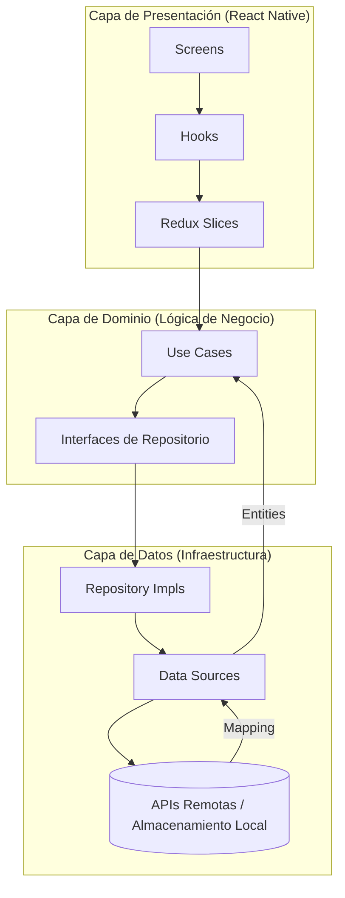

# CryptoApp 🚀

Una aplicación moderna y de alto rendimiento para el seguimiento de criptomonedas construida con **React Native** y **Expo**, siguiendo los principios de **Clean Architecture** y **Feature-Sliced Design (FSD)**.

## ✨ Características

- **Seguimiento en Tiempo Real**: Actualizaciones en vivo mediante WebSockets de CoinCap.
- **Datos de Mercado Completos**: Integración con las APIs de CoinGecko y CoinMarketCap.
- **Gráficos Históricos**: Visualización del comportamiento de precios en diferentes periodos de tiempo.
- **Modo Oscuro/Claro**: Detección automática del tema del sistema.
- **Persistencia Offline**: Acceso a datos cacheados incluso sin conexión a internet.
- **Alto Rendimiento**: Renderizado optimizado con FlashList y animaciones fluidas con Reanimated.

## 🏗️ Decisiones Arquitectónicas

El proyecto utiliza una combinación de **Clean Architecture** y **Feature-Sliced Design (FSD)** para garantizar que la lógica de negocio sea independiente de la interfaz de usuario y de los servicios externos.

### Capas del Proyecto:
1.  **Capa de Dominio (Domain)**: Contiene las entidades, las interfaces de los repositorios y los Casos de Uso. Es el corazón de la app y no depende de ninguna otra capa.
2.  **Capa de Datos (Data)**: Implementa los repositorios y gestiona las fuentes de datos (APIs REST, WebSockets, Almacenamiento Local).
3.  **Capa de Presentación (Presentation)**: Contiene los componentes de UI, pantallas, hooks personalizados y la gestión de estado con **Redux**.
4.  **Capa Core**: Infraestructura común, configuración de temas, navegación e inyección de dependencias.



## 🔐 Seguridad y Configuración

La aplicación gestiona datos sensibles y banderas de funcionalidades a través de variables de entorno (`src/core/config/env.ts`).

### Estrategia de Autenticación:
- Implementamos una estructura preparada para **JWT**.
- Uso de **SecureStore** para el almacenamiento de tokens sensibles.
- Soporte planificado para **Autenticación Biométrica** (FaceID/TouchID).

## 🚀 Cómo Correr el Proyecto

Sigue estos pasos para configurar el entorno de desarrollo:

1.  **Instalar dependencias**:
    ```bash
    npm install
    ```
2.  **Configurar variables de entorno**:
    Copia el archivo de ejemplo y añade tus claves de API:
    ```bash
    cp .env.example .env.development
    ```
3.  **Iniciar el servidor de desarrollo**:
    ```bash
    npx expo start
    ```
4.  **Ejecutar en un emulador**:
    - Presiona `i` para iOS.
    - Presiona `a` para Android.

## 🧪 Pruebas (Testing)

El proyecto utiliza **Jest** y **React Native Testing Library**.

```bash
# Correr todos los tests
npm test

# Correr tests con reporte de cobertura
npm run test:coverage
```

## �️ Stack Tecnológico

- **Framework**: Expo / React Native
- **Estado**: Redux Toolkit
- **Data Fetching**: TanStack Query (v5)
- **Animaciones**: React Native Reanimated
- **Persistencia**: AsyncStorage + Persist Client de TanStack Query

## 📶 Modo Offline Avanzado

- **Persistencia**: Los datos se guardan en el disco local automáticamente.
- **SWR (Stale-While-Revalidate)**: La app muestra los datos cacheados instantáneamente mientras se actualizan en segundo plano.
- **Indicador de Conexión**: Un componente `OfflineIndicator` sutil notifica al usuario cuando no hay red.

## � ¿Qué mejoraría con más tiempo?

Si tuviera más tiempo de desarrollo, me enfocaría en los siguientes puntos para llevar la app a un nivel de producción masivo:

1.  **Observabilidad**: Integrar **Sentry** para el rastreo de errores en tiempo real y **Firebase Analytics** para entender el comportamiento del usuario.
2.  **Gráficos Interactivos**: Migrar a `react-native-wagmi-charts` para permitir interacciones táctiles (scrubbing) y vistas de velas Japonesas.
3.  **CI/CD**: Configurar **GitHub Actions** para automatizar los tests y linting en cada PR, y **EAS Build** para distribuciones automáticas a las tiendas.
4.  **E2E Testing**: Implementar pruebas de extremo a extremo con **Maestro** para asegurar que los flujos críticos (Login, Navegación) nunca fallen.
5.  **Internacionalización (i18n)**: Soporte completo para múltiples idiomas (Inglés/Español).
6.  **Micro-interacciones**: Añadir **Haptic Feedback** y Skeleton Loaders para una sensación aún más premium y fluida.
