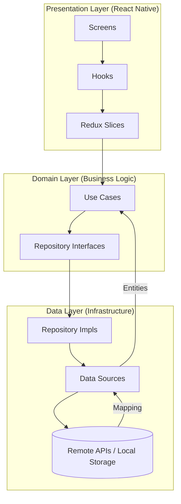

# CryptoApp 🚀

A modern, high-performance cryptocurrency tracking application built with React Native and Expo, following Clean Architecture and Feature-Sliced Design principles.

## ✨ Features

- **Real-time Price Tracking**: Live updates via CoinCap WebSockets.
- **Comprehensive Market Data**: Integration with CoinGecko and CoinMarketCap APIs.
- **Historical Charts**: Visualize price behavior over different time periods.
- **Automatic Theme Detection**: System-wide Dark/Light mode support.
- **Secure Configuration**: Environment-based configuration and feature flags.
- **High Performance**: Optimized list rendering with FlashList and smooth animations with Reanimated.

## 🏗️ Architecture & Data Flow

The project follows a modular architecture based on **Clean Architecture** and **Feature-Sliced Design**. This ensures that business logic is decoupled from UI and external APIs.



## � Security & Configuration

The app uses environment variables to manage sensitive data and toggle features via `src/core/config/env.ts`.

### Authentication Strategy (Roadmap)
- **JWT Authentication**: Transitioning to a production-grade flow using Access Tokens (stored in memory/secure memory) and Refresh Tokens (stored in `SecureStore`) to minimize XSS/injection risks.
- **Biometric Identity**: Implementation of `expo-local-authentication` for FaceID/TouchID as a fallback for secure session restoration.

### Environment Setup

1. Copy the example environment file:
   ```bash
   cp .env.example .env.development
   ```
2. Fill in your API keys in `.env.development`:
   - `EXPO_PUBLIC_COINMARKETCAP_API_KEY`: Your CMC Pro API Key.

### Feature Flags

Available flags in `.env` files:
- `EXPO_PUBLIC_ENABLE_CMC`: Toggle CoinMarketCap integration.
- `EXPO_PUBLIC_ENABLE_WEBSOCKET`: Enable/Disable real-time updates.
- `EXPO_PUBLIC_ENABLE_CHARTS`: Toggle historical charts visibility.

## 🧪 Testing

The project uses Jest and React Native Testing Library.

### Running Tests
```bash
# Run all tests
npm test

# Run tests with coverage report
npm run test:coverage

# Run tests and open HTML report
./run-tests-with-report.sh
```

## 🚀 Getting Started

1. Install dependencies:
   ```bash
   npm install
   ```
2. Set up your environment variables (see Configuration section).
3. Start the development server:
   ```bash
   npx expo start
   ```

## 🛠️ Tech Stack & DX

- **State & Data**: Redux Toolkit, TanStack Query (v5).
- **UI & UX**: FlashList (high-performance lists), Reanimated (60fps animations).
- **Quality Assurance**: Jest, React Native Testing Library.

### Developer Experience (DX)
- **Husky & Lint-staged**: Automated linting and testing before every commit.
- **Conventional Commits**: Standardized commit messages for clear history and automated changelogs.
- **Dependency Injection**: Decoupled initialization using a custom lightweight DI container (`src/core/di`).

## 📶 Advanced Offline Mode

- **Persistence**: Using `@tanstack/react-query-persist-client` with `AsyncStorage`.
- **Cache Logic**: implements "Stale-While-Revalidate" (SWR) fetching.
- **Connectivity**: Real-time awareness with `@react-native-community/netinfo` and a debounced `OfflineIndicator` to avoid UI flickering during transitions.

## 🚀 Future Roadmap

### 🔐 High Security
- **OAuth2/JWT**: Move from mock local auth to a hardened JWT flow with automatic token refreshing.
- **Secure Persistence**: Utilize `expo-secure-store` for all sensitive cryptographic and auth data.

### 📈 Pro Features
- **Advanced Charts**: Switch to `react-native-wagmi-charts` for interactive scrubbing and candlestick views.
- **Market Alerts**: Push notifications for price thresholds using Firebase Cloud Messaging (FCM).

### 🤖 Automation & Ops
- **GitHub Actions**: CI pipeline for automated testing and PR validation.
- **Sentry Integration**: Real-time error tracking and performance monitoring.
- **EAS Builds**: Automated deployment to TestFlight/Play Store via Expo Application Services
